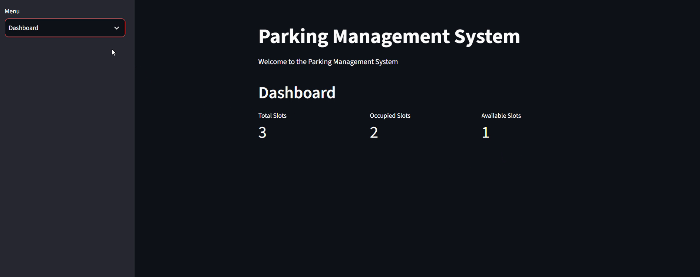
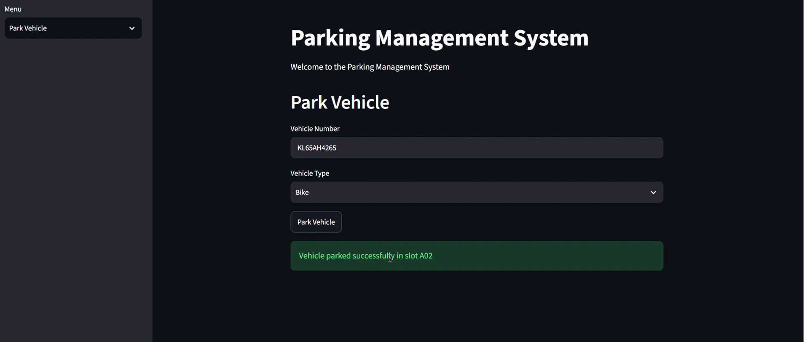
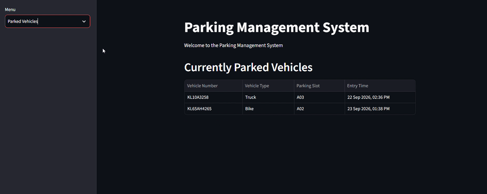

# Parking Management System

A simple and interactive parking management application developed using Python, Object-Oriented Programming (OOP), Streamlit, and JSON.

The application manages the complete parking workflow, from vehicle entry and slot allocation to vehicle exit, billing, and parking history.

## Features

- Vehicle registration and validation
- Automatic parking slot allocation
- Real-time parking slot availability
- Vehicle entry and exit management
- Parking duration and fee calculation
- Parking bill generation
- Dashboard for monitoring parking status
- Currently parked vehicle records
- Parking history management
- JSON-based data storage
- Automatic slot release and reuse

## Technologies Used

- Python
- Object-Oriented Programming (OOP)
- Streamlit
- JSON
- Datetime

## How to Run

1. Clone the repository.

```bash
git clone https://github.com/Jyothisreek123/parking-management-system.git
```

2. Navigate to the project folder.

```bash
cd parking-management-system
```

3. Install the required dependency.

```bash
pip install streamlit
```

4. Run the Streamlit application.

```bash
python -m streamlit run app.py
```

5. Open the local URL shown in the terminal.

## Project Highlights

- Applied Object-Oriented Programming using classes and methods
- Implemented automatic parking slot allocation
- Added vehicle entry and exit management
- Implemented parking duration and fee calculation
- Added input validation and duplicate vehicle checking
- Used JSON for storing and loading parking data
- Implemented parking history management
- Built an interactive user interface using Streamlit
- Added automatic slot release and reuse

## Project Structure

```text
parking-management-system/
│
├── app.py
├── parking.py
├── vehicle.py
├── parking_data.json
├── parking_history.json
├── .gitignore
└── README.md
```

## Data Storage

The application uses JSON files for persistent data storage.

- `parking_data.json` — stores currently parked vehicles
- `parking_history.json` — stores completed parking records


## Screenshots

### Dashboard



### Park Vehicle



### Parked Vehicles


